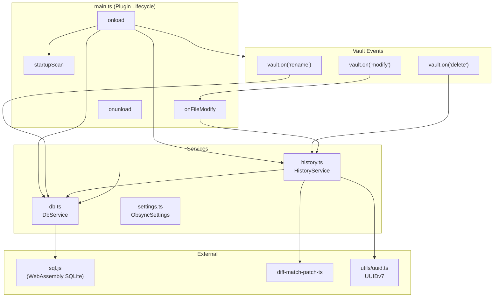
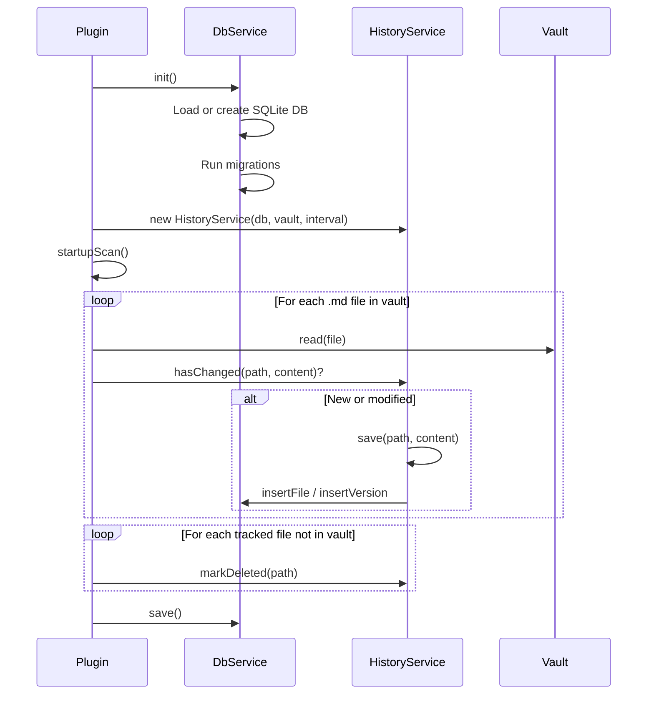
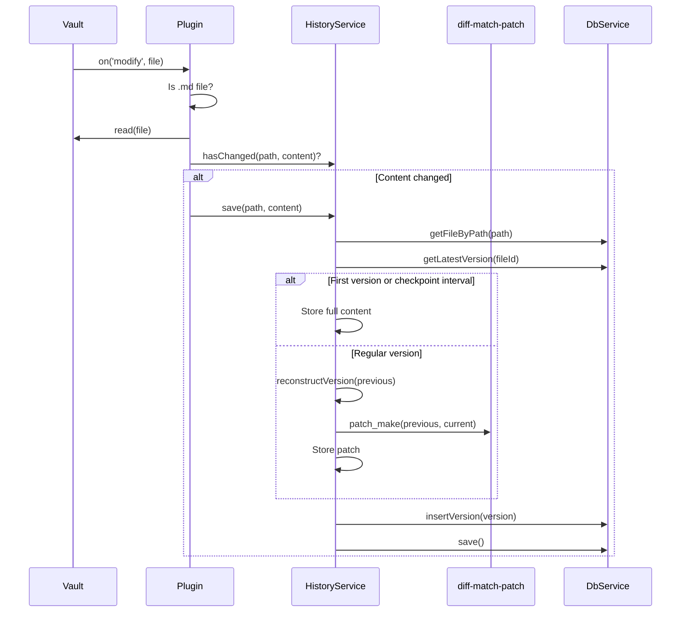
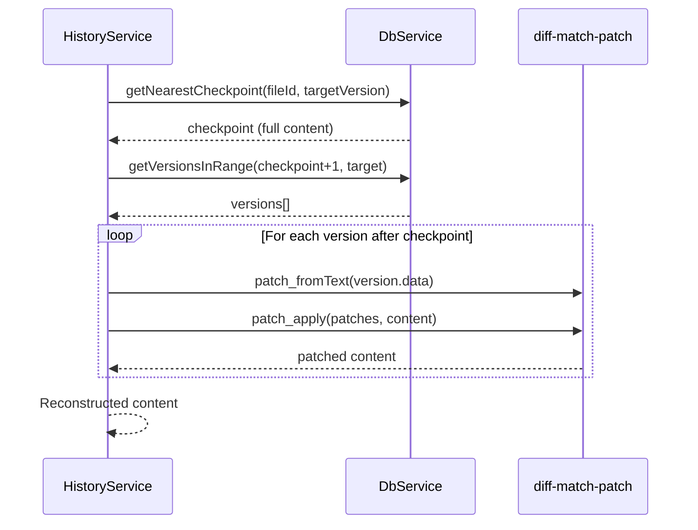
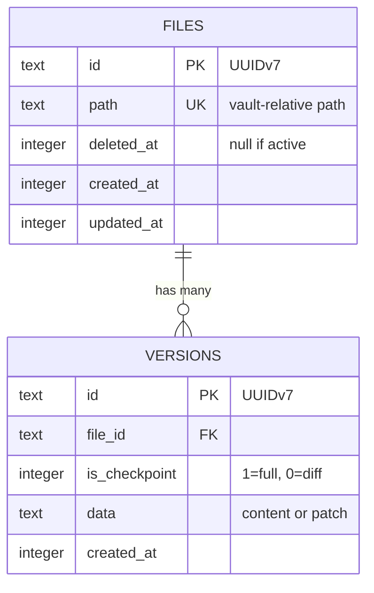
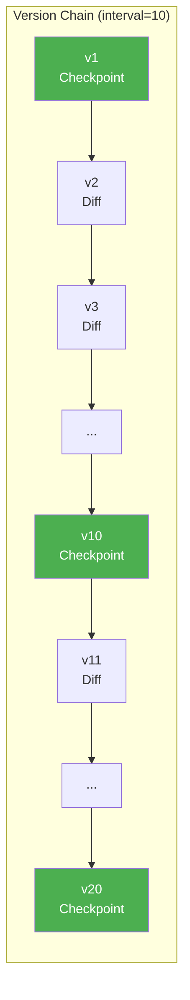
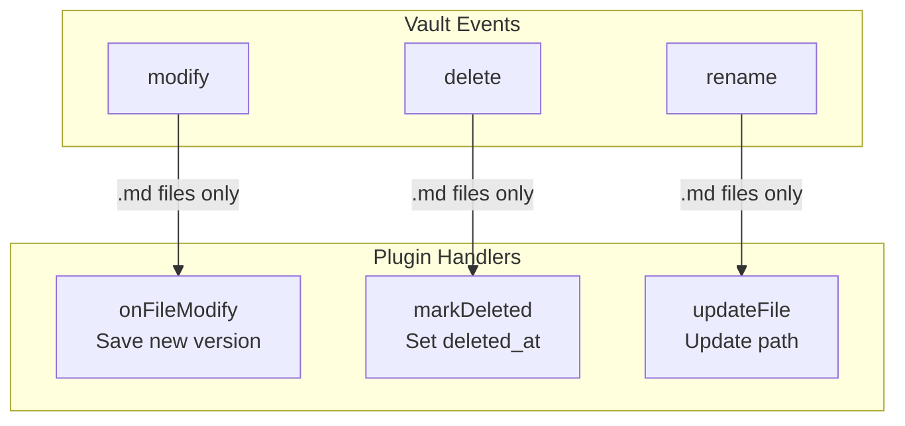
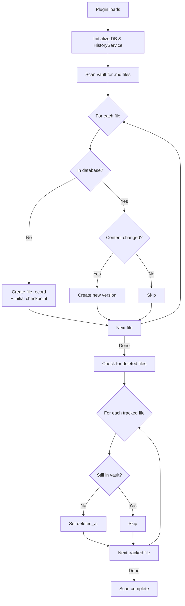

# Obsync Architecture

## Overview

Obsync is an Obsidian plugin that tracks file versions using diffs, storing history in a SQLite database. It provides Google Docs-like version history - users can view diffs and restore previous versions.

## Design Decisions

| Decision | Choice | Rationale |
|----------|--------|-----------|
| **Trigger** | On file save | Aligns with user expectations; saves are intentional checkpoints |
| **Storage** | Hybrid (diffs + checkpoints) | Balances storage efficiency with reconstruction speed |
| **Checkpoint interval** | Configurable (default: 10) | At most 10 patches to reconstruct any version |
| **File scope** | Markdown only (`.md`) | Core Obsidian content; binary files don't diff well |
| **Deleted files** | Keep history forever | History is the point; mark `deleted_at` for UI purposes |
| **Restoration** | In-place | Simple, direct; overwrites or recreates file |
| **IDs** | UUIDv7 | Time-sortable, globally unique, future sync-friendly |
| **Database** | sql.js (WebAssembly) | Pure JS, works in Obsidian's Electron environment |

## Component Architecture



## Data Flow

### On Plugin Load



### On File Save



### Version Reconstruction



## Database Schema



## Storage Strategy



**Reconstruction example (v15):**
1. Find nearest checkpoint: v10
2. Load v10 (full content)
3. Apply patches: v11, v12, v13, v14, v15
4. Result: content at v15

## File Structure

```
src/
├── main.ts           # Plugin lifecycle, event hooks
├── settings.ts       # Settings interface (checkpointInterval)
├── history.ts        # HistoryService (save, diff, reconstruct, restore)
├── db.ts             # SQLite wrapper (connection, migrations, queries)
└── utils/
    └── uuid.ts       # UUIDv7 generation
```

## Event Handling



## Startup Scan Logic



## Dependencies

| Package | Purpose |
|---------|---------|
| `sql.js` | Pure JavaScript SQLite via WebAssembly |
| `diff-match-patch-ts` | Text diffing and patching |
| `obsidian` | Obsidian plugin API |
