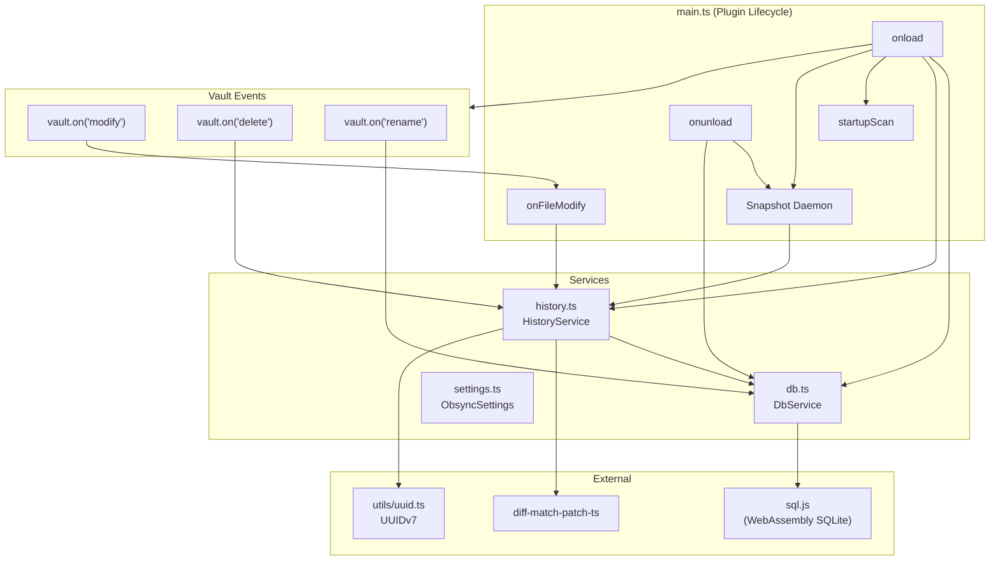
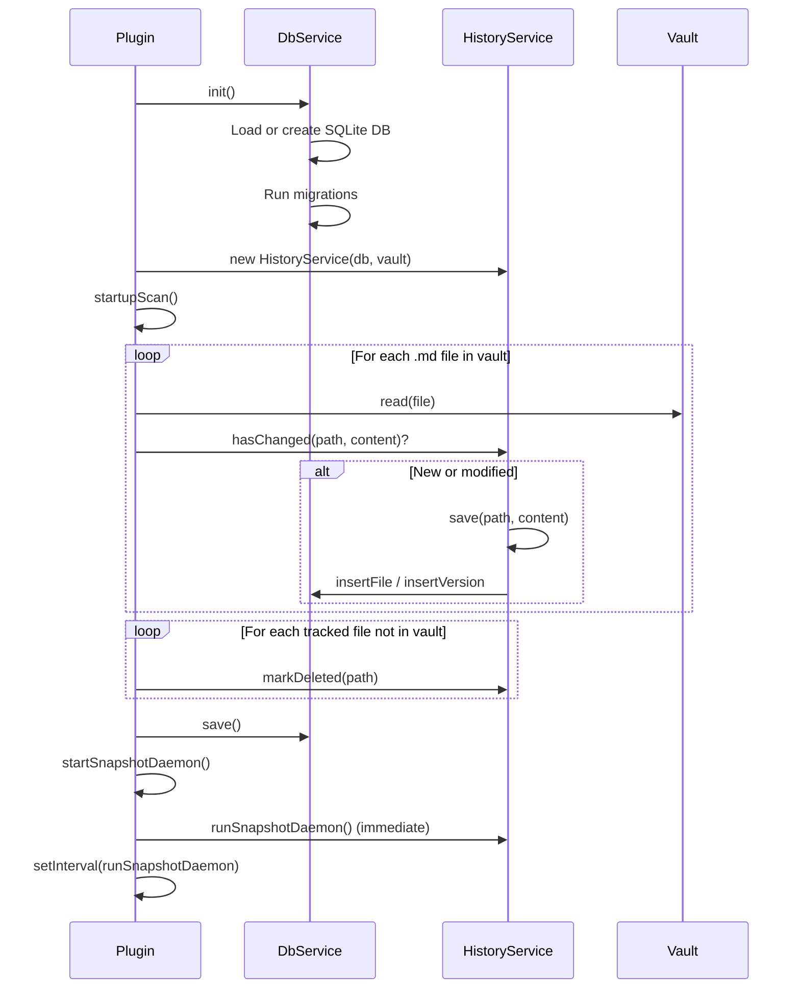
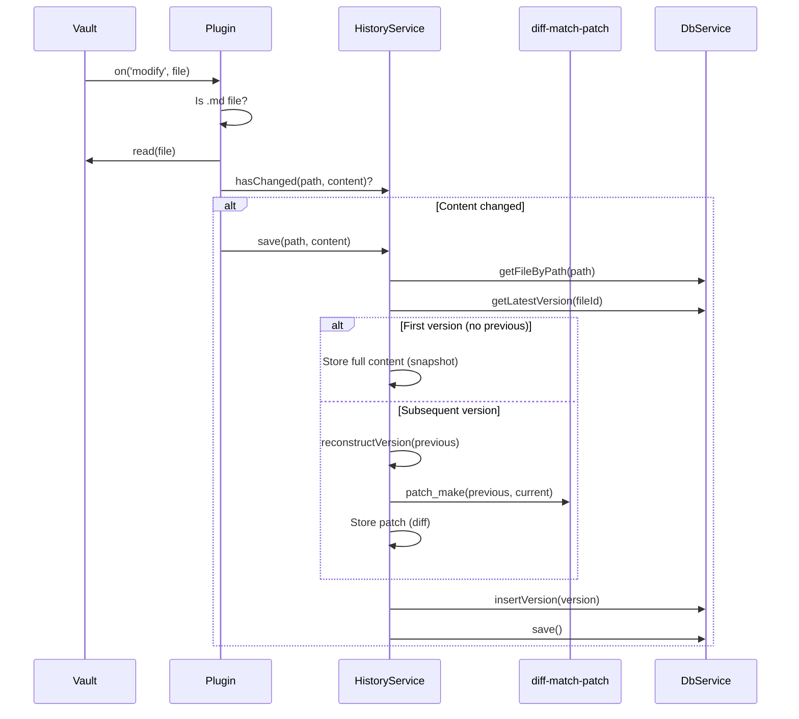
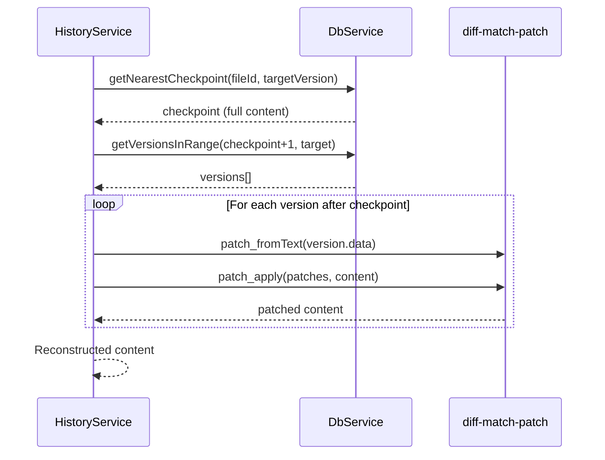
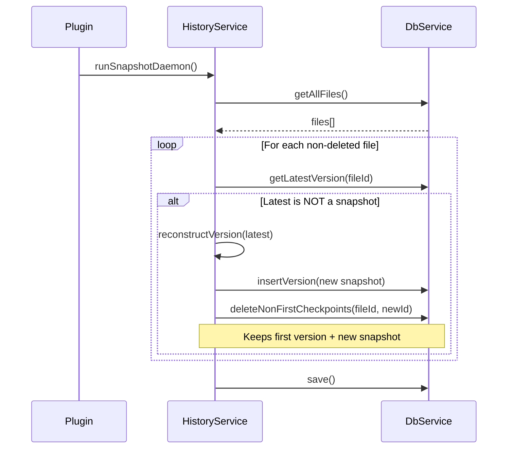
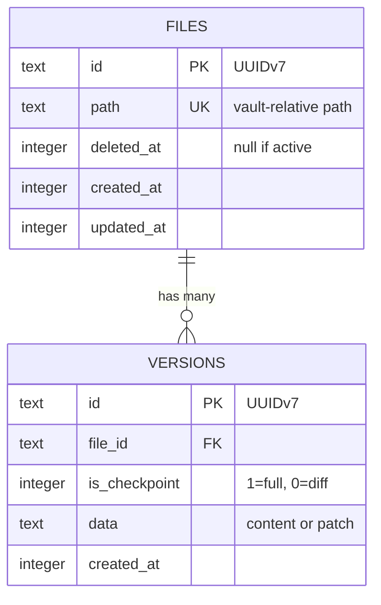
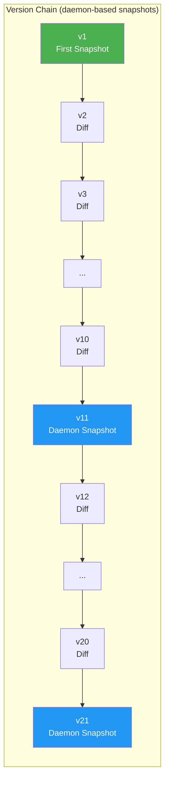
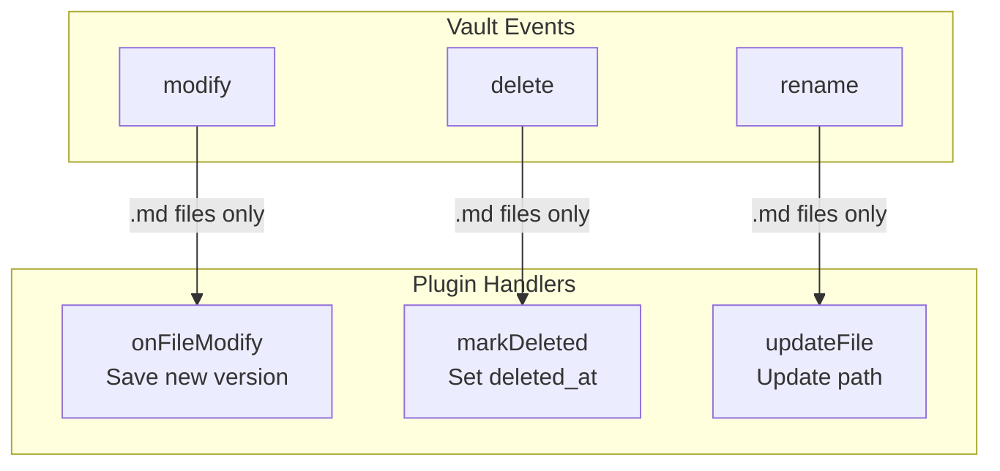
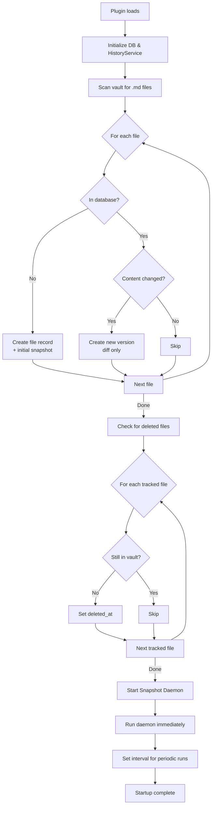

# Obsync Architecture

## Overview

Obsync is an Obsidian plugin that tracks file versions using diffs, storing history in a SQLite database. It provides Google Docs-like version history - users can view diffs and restore previous versions.

## Design Decisions

| Decision | Choice | Rationale |
|----------|--------|-----------|
| **Trigger** | On file save | Aligns with user expectations; saves are intentional checkpoints |
| **Storage** | Hybrid (diffs + snapshots) | Balances storage efficiency with reconstruction speed |
| **Snapshot strategy** | Daemon-based (default: 10 min) | First version is always a snapshot; daemon creates periodic snapshots for files with changes |
| **Max snapshots per file** | 2 (first + daemon) | Keeps storage bounded while ensuring fast reconstruction |
| **File scope** | Markdown only (`.md`) | Core Obsidian content; binary files don't diff well |
| **Deleted files** | Keep history forever | History is the point; mark `deleted_at` for UI purposes |
| **Restoration** | In-place | Simple, direct; overwrites or recreates file |
| **IDs** | UUIDv7 | Time-sortable, globally unique, future sync-friendly |
| **Database** | sql.js (WebAssembly) | Pure JS, works in Obsidian's Electron environment |

## Component Architecture



## Data Flow

### On Plugin Load



### On File Save



### Version Reconstruction



### Snapshot Daemon

The snapshot daemon runs periodically (default: every 10 minutes) to create snapshots for files that have been modified since the last snapshot. This ensures reconstruction never requires applying too many diffs.



**Key behaviors:**
- Runs immediately on plugin startup, then every N minutes
- Only creates snapshot if latest version is a diff
- Deletes previous daemon-created snapshots (keeps max 2 per file: first + latest)
- Restarts when settings change

## Database Schema



## Storage Strategy



**Legend:**
- 🟢 Green: First version snapshot (kept forever)
- 🔵 Blue: Daemon-created snapshot (only latest kept)

**Snapshot lifecycle:**
1. First save → v1 is always a full snapshot
2. Subsequent saves → diffs only
3. Daemon runs (every 10 min) → creates snapshot if latest is a diff
4. When daemon creates v21, it deletes v11 (keeps only first + latest snapshot)

**Reconstruction example (v15):**
1. Find nearest checkpoint: v11 (daemon snapshot)
2. Load v11 (full content)
3. Apply patches: v12, v13, v14, v15
4. Result: content at v15

## File Structure

```
src/
├── main.ts           # Plugin lifecycle, event hooks, snapshot daemon
├── settings.ts       # Settings interface (snapshotIntervalMinutes)
├── history.ts        # HistoryService (save, diff, reconstruct, restore, runSnapshotDaemon)
├── db.ts             # SQLite wrapper (connection, migrations, queries)
├── ui/
│   └── HistoryModal.ts  # Version history UI
└── utils/
    └── uuid.ts       # UUIDv7 generation
```

## Event Handling



## Startup Scan Logic



## Dependencies

| Package | Purpose |
|---------|---------|
| `sql.js` | Pure JavaScript SQLite via WebAssembly |
| `diff-match-patch-ts` | Text diffing and patching |
| `obsidian` | Obsidian plugin API |
