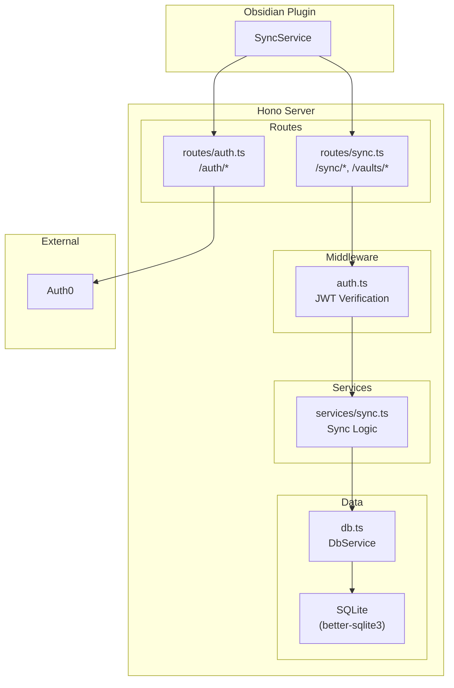
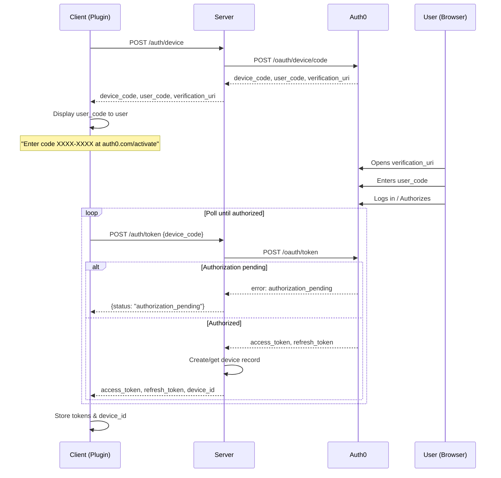
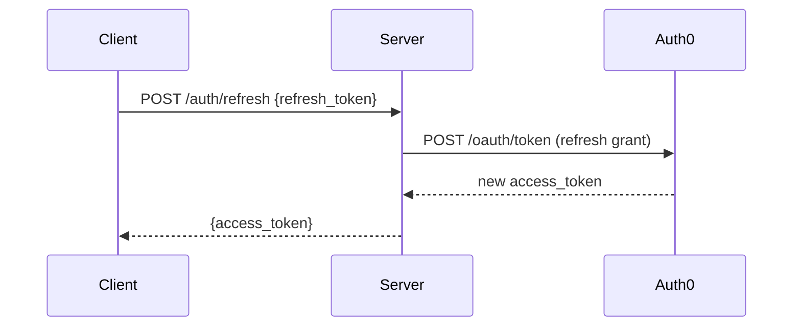
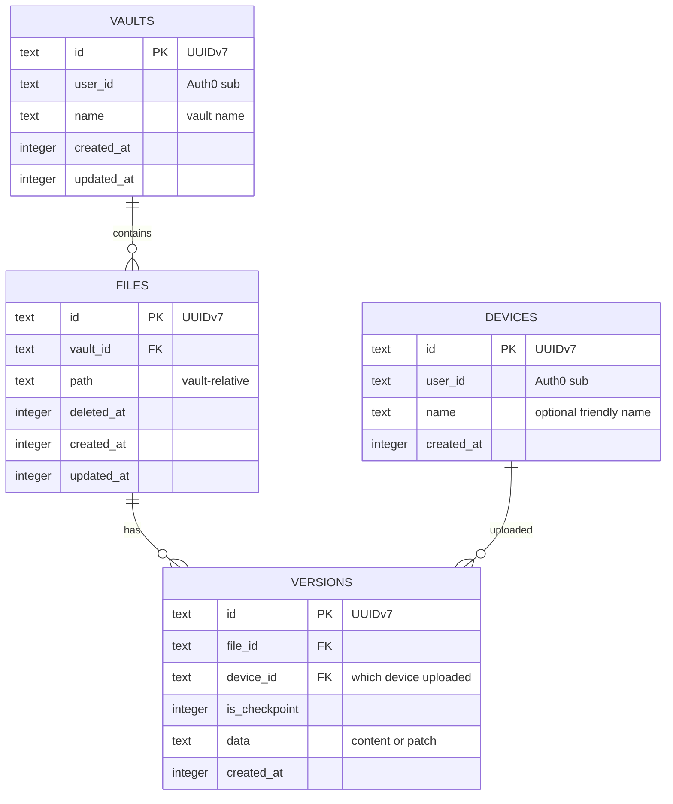
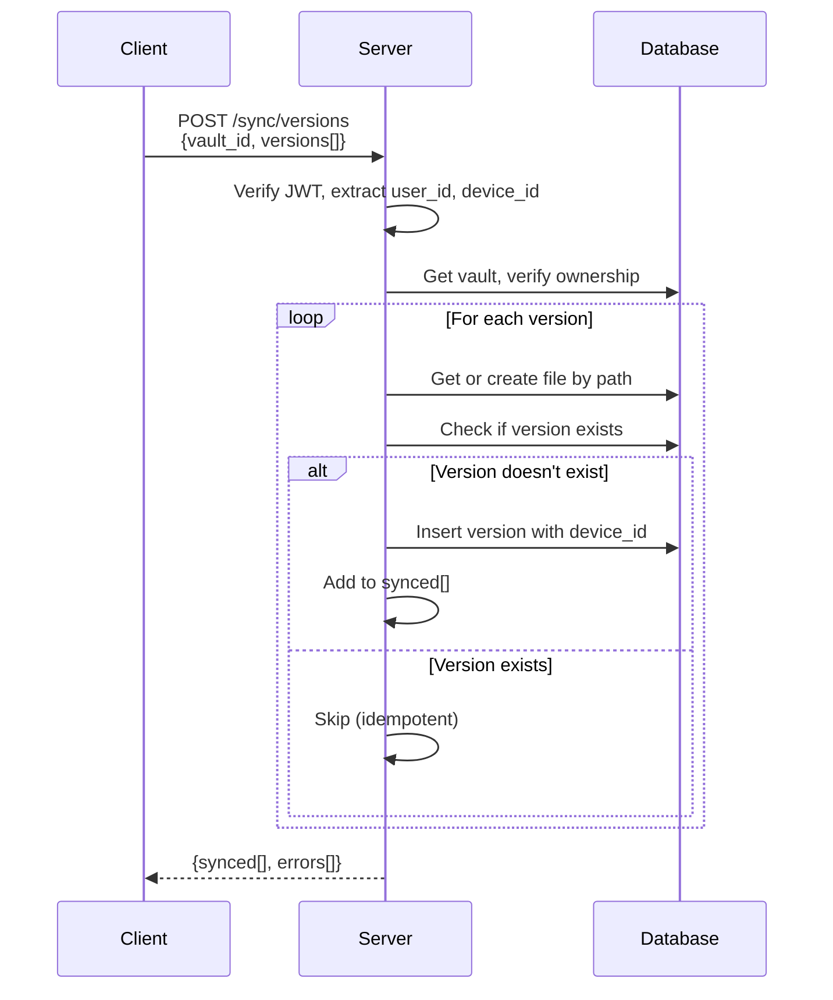

# Obsync Server Architecture

## Overview

The Obsync server provides cloud synchronization for version history data. It uses Auth0 for authentication with the Device Authorization Flow, allowing the Obsidian plugin to authenticate without requiring a browser callback.

## Design Decisions

| Decision | Choice | Rationale |
|----------|--------|-----------|
| **Auth provider** | Auth0 | Mature OAuth provider with device flow support |
| **Auth flow** | Device Authorization | Best for CLI/desktop apps; no callback URL needed |
| **Framework** | Hono | Lightweight, fast, modern TypeScript support |
| **Database** | SQLite (better-sqlite3) | Simple deployment, same SQL patterns as client |
| **Sync direction** | One-way (v1) | Clients upload to server; bi-directional in v2 |
| **IDs** | UUIDv7 | Same as client; globally unique, time-sortable |

## Component Architecture



## Authentication Flow

### Device Authorization Flow



### Token Refresh



## Database Schema



**Key differences from client schema:**
- `devices` table: tracks which devices belong to which users
- `vaults` table: users can have multiple vaults
- `files.vault_id`: files belong to vaults instead of having user_id directly
- `versions.device_id`: tracks which device uploaded each version

## API Endpoints

### Auth Endpoints

| Method | Path | Auth | Description |
|--------|------|------|-------------|
| POST | `/auth/device` | None | Initiate device auth flow |
| POST | `/auth/token` | None | Poll for tokens |
| POST | `/auth/refresh` | None | Refresh access token |

### Vault Endpoints

| Method | Path | Auth | Description |
|--------|------|------|-------------|
| GET | `/vaults` | Required | List user's vaults |
| POST | `/vaults` | Required | Create new vault |

### Sync Endpoints

| Method | Path | Auth | Description |
|--------|------|------|-------------|
| POST | `/sync/versions` | Required | Upload versions |

## Sync Data Flow

### Upload Versions



## File Structure

```
server/
├── src/
│   ├── index.ts              # Hono app entry point
│   ├── db.ts                 # SQLite wrapper
│   ├── config.ts             # Environment configuration
│   ├── middleware/
│   │   └── auth.ts           # JWT verification
│   ├── routes/
│   │   ├── auth.ts           # /auth/* endpoints
│   │   └── sync.ts           # /sync/*, /vaults/* endpoints
│   └── services/
│       └── sync.ts           # Sync business logic
├── package.json
└── tsconfig.json
```

## Configuration

Environment variables:

| Variable | Description | Required |
|----------|-------------|----------|
| `PORT` | Server port | No (default: 3000) |
| `AUTH0_DOMAIN` | Auth0 tenant domain | Yes |
| `AUTH0_CLIENT_ID` | Auth0 application client ID | Yes |
| `AUTH0_CLIENT_SECRET` | Auth0 application client secret | Yes |
| `AUTH0_AUDIENCE` | Auth0 API audience | Yes |
| `DATABASE_PATH` | Path to SQLite database | No (default: ./data/obsync.db) |

## Security Considerations

1. **JWT Verification**: All sync endpoints verify JWT tokens using Auth0's JWKS
2. **User Isolation**: Users can only access their own vaults and data
3. **Device Tracking**: Each version records which device uploaded it
4. **Idempotent Uploads**: Re-uploading the same version ID is a no-op

## Dependencies

| Package | Purpose |
|---------|---------|
| `hono` | Web framework |
| `@hono/node-server` | Node.js adapter for Hono |
| `better-sqlite3` | Synchronous SQLite for Node.js |
| `jose` | JWT verification |

## Future Considerations (v2)

- Bi-directional sync (download versions from server)
- Conflict resolution for concurrent edits
- Vault sharing between users
- Webhook notifications for real-time sync
